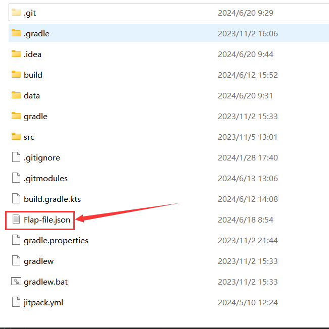

## Introduction

The project can analyze dependency from kotlin(jvm) projects with
granularity in file, method and structure.

This is a kotlin(jvm) module of project
[Depends-Core](https://github.com/XYZboom/depends-core) which
is the improved version of 
[Depends](https://github.com/multilang-depends/depends).

## Run Tool
### Runtime requirement
Java Runtime Environment (JRE) >= 17
### Simple usage
Download jar file in [release page](https://github.com/XYZboom/depends-kotlin/releases).
```bash
java depends-kotlin-all.jar kotlin [input-path] [output-file]
```
### Run on project in data directory
- [x] **Step 1. Clone project recursively**
```bash
git clone --recurse-submodules https://github.com/XYZboom/depends-kotlin.git
```
- [x] **Step 2. Download jar file in [release page](https://github.com/XYZboom/depends-kotlin/releases)**
- [x] **Step 3. Specify the input project and output path**
The example here runs on project "Flap" in data directory.
The file "depends-kotlin-all.jar" was the jar you just downloaded.
```bash
java depends-kotlin-all.jar kotlin ./data/Flap Flap --show-language
```
- [x] **Step 4. Check the output file**
After step 3, you will see the output file: "Flap-file.json" in root
path of this project.

### Usage
Depends-Kotlin is based on the JVM platform and requires at least Java 17. 
The input of Depends-Kotlin is the source folder path of a particular project. 
The full command line arguments are as follows:

    Usage: depends [-hms] [--auto-include] [-d=<dir>] [-g=<granularity>]
                   [-p=<namePathPattern>] [-f=<format>[,<format>...]]...
                   [-i=<includes>[,<includes>...]]... <lang> <src> <output>
          <lang>                 The language of project files
          <src>                  The directory to be analyzed
          <output>               The output file name
          --auto-include         auto include all paths under the source path 
      -i, --includes             The files of searching path
      -d, --dir                  The output directory
      -f, --format               The output format
      -g, --granularity=<granularity>
                                 Granularity of dependency.  
      -h, --help                 Display this help and exit
      -s, --strip-leading-path   Strip the leading path.
          --show-language        Show language info in dependency type
      
      -m, --n-map-files          Output DV8 dependency map file.
      -p, --namepattern=<namePathPattern>
                                 The name path separators.[default(/),dot(.)

## Build from source
### Requirement
JDK >= 17
Gradle >= 7.5.1
### Build steps
Depends-Kotlin can be built and run by following 3 steps. 

- [x] **Step 1. Clone repository** 

Our repository is hosted on GitHub, you can clone the source code with the following command: 

```bash
git clone https://github.com/XYZboom/depends-kotlin.git 
```

- [x] **Step 2. Compile project** 

Before compiling, make sure you have the Java 17 runtime ready. After that, run the following command at the root of your project to compile it: 

- on windows 

```powershell
gradlew.bat build 
```

- on linux 

```bash
gradlew build 
```

Meanwhile, the -x test option can be used to skip testing. At this point, Gradle Wapper will pull the necessary dependencies and compile them.

- [x] **Step 3. Generate Runnable Jar**

After successful compilation, you can use Gradle’s shadow plugin to package it as an executable jar using the following command: 

- on windows 

```powershell
gradlew.bat shadowJar 
```

- on linux 

```bash
gradlew shadowJar 
```

You will see the following output and find an executable jar package with the suffix **. all.jar* in the *projectRoot/build/libs* folder.
