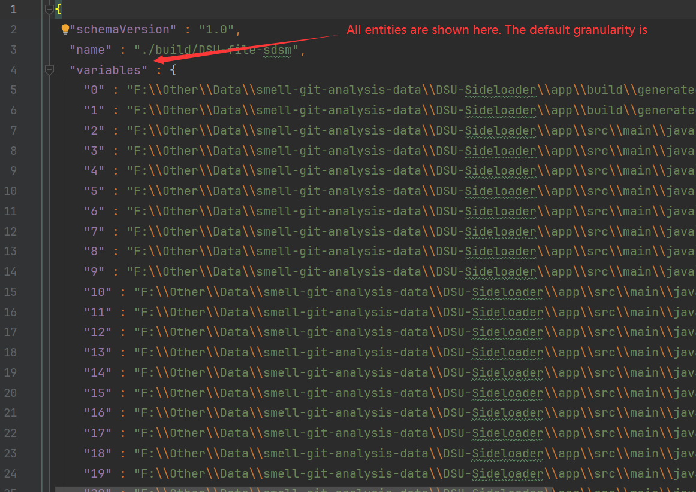
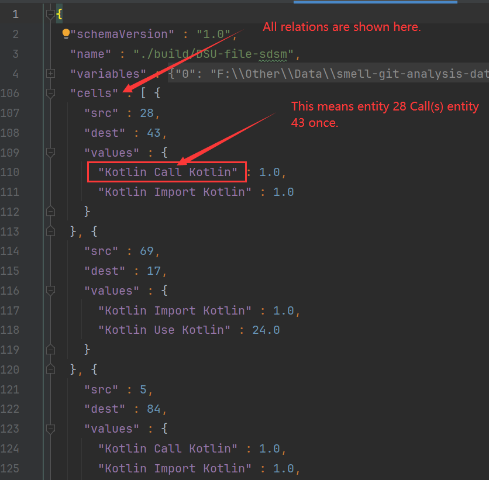

## This folder contains dataset of the paper: Depends-Kotlin: A Cross-language Kotlin Dependency Extractor.

Folder **project-source-code** contains the source code of 3 projects analyzed by Depends-Kotlin in thd paper.
Use `git submodule update --init --recursive` to fetch the source code.

Folder **depends-kotlin-output** contains the analysis results of the 3 projects.

